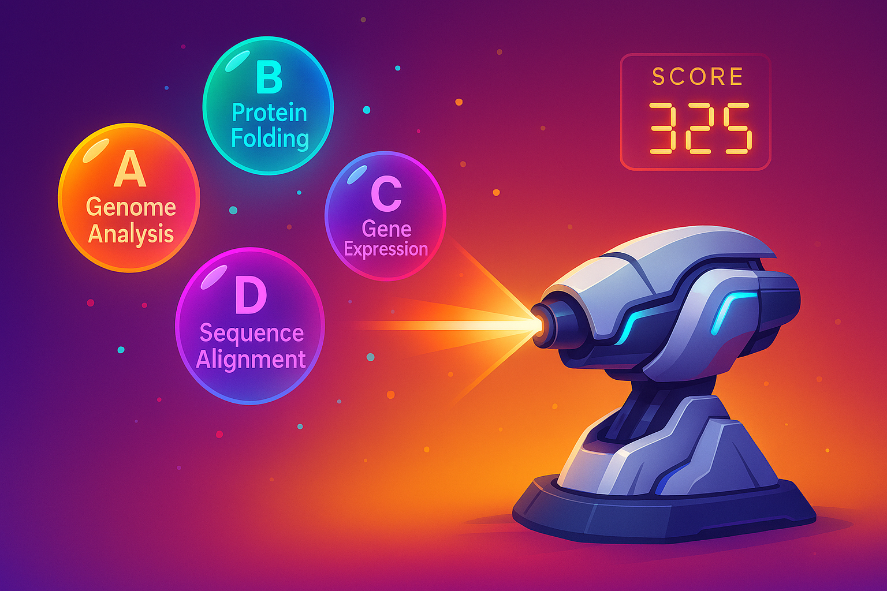

# BioShooter: Bioinformatics-Quiz-Shooter
An interactive bioinformatics quiz shooter game — answer questions to defend your base and boost your science skills!

Play the game here: https://Arittra95.github.io/BioShooter-Bioinformatics-Quiz-Shooter/

## Scoring and Accuracy Explained

- **Score**: The number of correct answers you have successfully hit during the game.
- **Wrong**: The number of incorrect hits or missed answers.
- **Accuracy**: The percentage of correct hits out of your total attempts (correct + wrong).

**Example:**  
If you hit 40 correct answers but also hit 38 wrong answers, your accuracy will be approximately 51.3%. This means that while you scored well, many of your shots were incorrect.

**Why Accuracy Matters:**  
Accuracy encourages careful and precise gameplay. Randomly shooting without aiming will increase your wrong hits, lowering your accuracy even if you score some points by chance. The best players balance speed with precision to maximize both score and accuracy.

